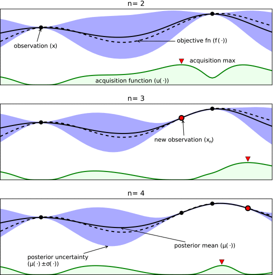

==========
Strategies
==========

Summit has several machine learning strategies available for optimisation, as well as some more naive ones. 

All strategies have a similar API. They are instantiated by passing in a :class:~`summit.domain.Domain`. New reaction conditions are requested using the `suggest_experiments` method which, potentially, takes results from previous reactions.

It is also possible to pass a transforms_.

Bayesian Optimisation
---------------------

Bayesian optimisation (BO) is an efficient way to optimise a wide variety of functions, inculding chemical reactions. In BO, you begin by specifying some prior beliefs about your functions. In many cases, we start with an assumption that we know very little. Then, we create a probabilistic model that incorporates this prior belief and some data (i.e, reactions at different conditions), called a posterior. In reaction optimisation, this model will predict the value of an objective (e.g., yield) at particular reaction conditions. One key factor is that these models a probabalistic, so they do not give precise predictions but instead a distribution that is sampled.

With the updated model, we use one of two classes of techniques to select our next experiments. Some BO strategies optimise an acquisition function, which is a function that takes in the model parameters and some suggested next experiement and predicts the quality of that experiment. Alternatively, a deterministic function can be sampled from the model, which is then optimised. 

   Illustration of how acquisition functions eanble BO strategies to reduce uncertainty and maximise objective simulataneously. Dotted line is actual objective and solid line is posterior of surrogate model. Acquisition function is high where objective to be optimal (exploration) and where there is high uncertainty (exploitation). Adapted from `Shahriari et al. <https://www.cs.ox.ac.uk/people/nando.defreitas/publications/BayesOptLoop.pdf>`_

To learn more about BO, we suggest reading the review by `Shahriari et al. <https://www.cs.ox.ac.uk/people/nando.defreitas/publications/BayesOptLoop.pdf>`_

The BO strategies available in Summit are:

* TSEMO_
* GRYFFIN_
* SOBO_

.. _TSEMO:
TSEMO
^^^^^

.. autoclass:: summit.strategies.tsemo.TSEMO
   :members:

.. _GRYFFIN:
GRYFFIN
^^^^^^^

.. autoclass:: summit.strategies.gryffin.GRYFFIN
   :members:

.. _SOBO:
SOBO
^^^^

.. autoclass:: summit.strategies.sobo.SOBO
   :members:

Reinforcement Learning
----------------------

.. autoclass:: summit.strategies.deep_reaction_optimizer.DRO
   :members:

Simplex
-------
.. autoclass:: summit.strategies.neldermead.NelderMead
   :members:

Random
-------
.. autoclass:: summit.strategies.random.Random
   :members:

.. autoclass:: summit.strategies.random.LHS
   :members:

Other
-----
.. autoclass:: summit.strategies.snobfit.SNOBFIT
   :members:

.. autoclass:: summit.strategies.factorial_doe.FullFactorial
   :members: